# LocalStacker

A local-first, zero-account desktop GUI for [LocalStack](https://localstack.cloud) —
browse and operate your local AWS resources without reaching for the CLI.

> Community project. **Not affiliated with LocalStack GmbH.**

[](https://github.com/thuanlegit/localstacker/actions/workflows/ci.yml)
[](https://github.com/thuanlegit/localstacker/releases)
[](./LICENSE)
[](https://buymeacoffee.com/ryleth)

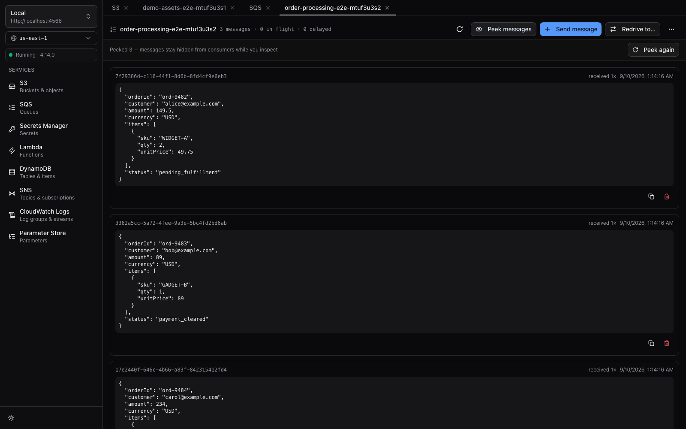

LocalStacker delivers a fast, keyboard-driven desktop companion for local AWS development. Operating entirely on your machine, it communicates directly with `localhost:4566` without cloud accounts, telemetry, or external subscriptions.

## Install

Download the latest prebuilt installer from [GitHub Releases](https://github.com/thuanlegit/localstacker/releases/latest):

| Platform | Format | Notes |
|---|---|---|
| **macOS** | `.dmg` | Apple silicon (`aarch64-apple-darwin`) |
| **Windows** | `.exe` | NSIS installer (auto-updates enabled) |
| **Linux** | `.AppImage` | x86_64 binary (auto-updates enabled) |

LocalStacker includes a built-in auto-updater that notifies you when a new release is available and handles update installation and relaunch in one click.

## Features

| Service | Capabilities |
|---|---|
| **S3** | Folder-style browsing with object previews, drag & drop uploads, downloads, presigned URL generation |
| **SQS** | Real-time queue depth & in-flight metrics, send validated JSON messages, **peek messages without consuming**, purge, dead-letter queue redrive |
| **Secrets Manager** | List secrets, create and update secrets, reveal decrypted secret values, delete secrets (explains LocalStack Hobby+ auth token requirements) |
| **Lambda** | Function listing, configuration inspection (runtime, handler, env vars), **invoke with test payload → response status + payload + logs (LogType=Tail)**, edit environment variables |
| **DynamoDB** | Tables list, key schema (`HASH`/`RANGE`), GSIs/LSIs, virtualized item grid, Scan & Query (PK/SK expressions), JSON item editor, delete item, clear table |
| **SNS** | Topics list (standard & FIFO), attributes, subscriptions list, publish message (payload + attributes), subscribe SQS queue helper |
| **CloudWatch Logs** | Log groups & streams exploration, virtualized log viewer with live tailing & search filter, deep-link from Lambda function view |
| **SSM Parameter Store** | Parameters in path hierarchy and flat views, type badges (`String`, `StringList`, `SecureString`), decrypted value toggle, create/update/delete |
| **EventBridge** | Event buses (default & custom), rules explorer with event pattern viewer/editor, target management (Lambda, SQS, SNS), rule enable/disable, PutEvents test event publisher |
| **EventBridge Scheduler** | Schedule groups, schedules list (rate/cron/at) with enable/disable toggles, create/delete schedules, target & payload inspector |
| **API Gateway** | REST APIs listing, resource tree, method inspector, stage deployments, **built-in Method Test Runner** (`TestInvokeMethod`) |
| **SES** | Verified email & domain identities, send test email modal, **LocalStack Captured Mailbox** with HTML, plaintext, raw MIME, and attachment tabs |
| **IAM** | Roles, users, and policies listing, trust relationship policy inspector, inline policy editor with syntax-highlighted JSON viewer, user access keys manager (.env copy helper) |
| **Route 53** | Hosted zones explorer (public/private), virtualized ResourceRecordSets grid (@tanstack/react-virtual), DNS records editor (A, AAAA, CNAME, TXT, MX, etc.) with TTL & value validation |
| **EC2** | Instances list with mock state transitions (Start, Stop, Reboot, Terminate), Key Pairs manager (create with .pem download, delete), Security Groups list with visual Inbound/Outbound rule matrix visualizer, Authorize/Revoke ingress & egress rules |
| **Docker** | Container lifecycle management via local Docker socket (`bollard`): detect/inspect LocalStack containers (including `localstack-persist`), start/stop/restart/remove with persistence-aware warnings, real-time snapshot + follow logs console, launch wizard with visual service picker (`SERVICES`), image pull progress & auto-connect |
| **Step Functions** | State machine list, ASL definition viewer, execution runner with event history timeline, visual state graph (`react-flow`) |
| **DynamoDB Streams** | Enable/disable table streams with view selection, shard explorer with **record peek (no consumption)**, decoded New/Old image JSON viewer |
| **Kinesis** | Data streams list with create wizard, shard map, **record peek via TRIM_HORIZON iterator**, test record publisher (PutRecord), enhanced consumers (EFO) list |
| **CloudWatch** | Custom metric browser (namespace/dimension filter) with inline statistics viewer, PutMetricData test publisher, threshold alarm create/delete with state badges & detail drawer, STS caller identity chip on Home |
| **KMS** | Symmetric key list with create & scheduled deletion, key detail view with aliases management, **encrypt/decrypt playground** (plaintext ↔ base64), key policy viewer, rotation status |
| **ACM** | Certificate inventory with status badges, DNS-validated certificate requests with **CNAME validation token display**, PEM certificate import, inline detail drawer (subject, issuer, validity, SANs) |
| **CloudFormation** | Stack inventory with status badges, stack inspector (outputs, resources, **event timeline**, template viewer), delete stack; Route 53 Resolver endpoints & rules sections |

### S3 Object Preview
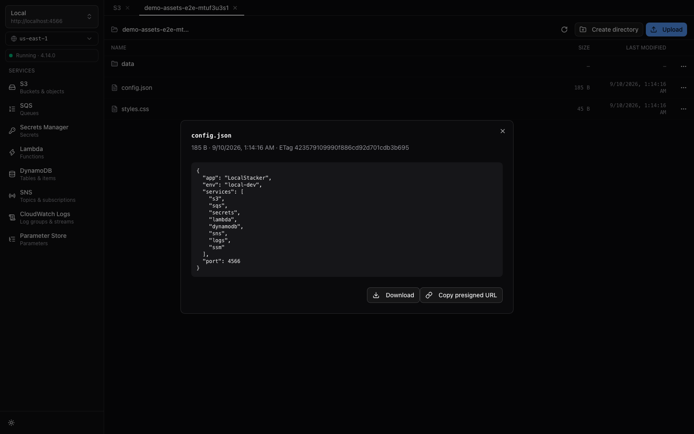

### Lambda Invocation & Execution Logs
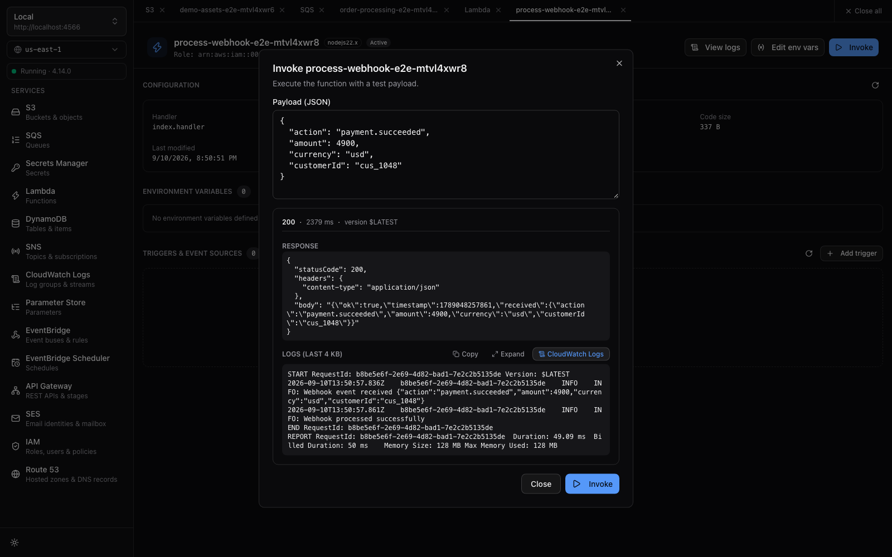

### DynamoDB Table Browser & JSON Inspector
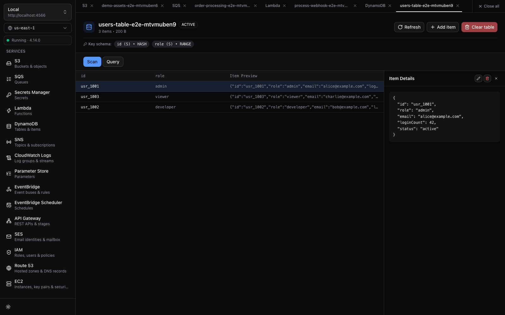

### SNS Topics & Subscriptions
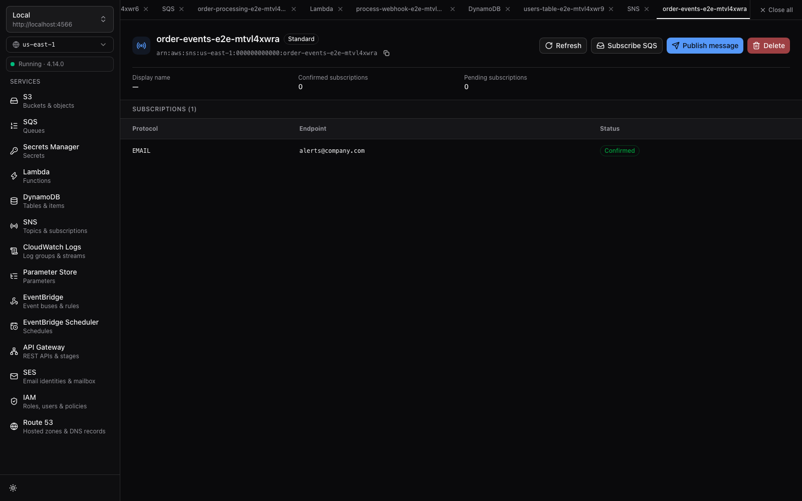

### CloudWatch Logs Live Tailing & Search
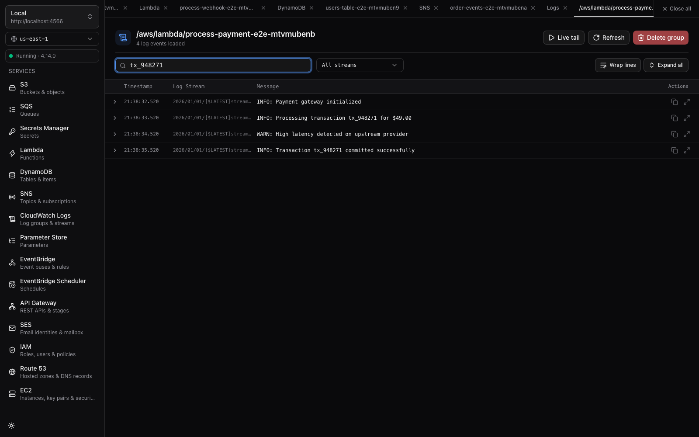

### SSM Parameter Store Hierarchy
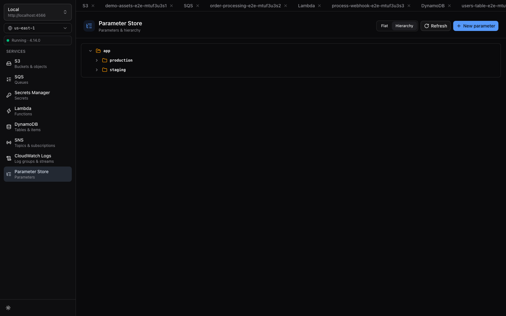

### EventBridge Buses & Rules
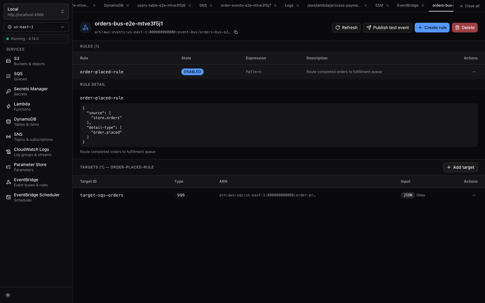

### EventBridge Scheduler
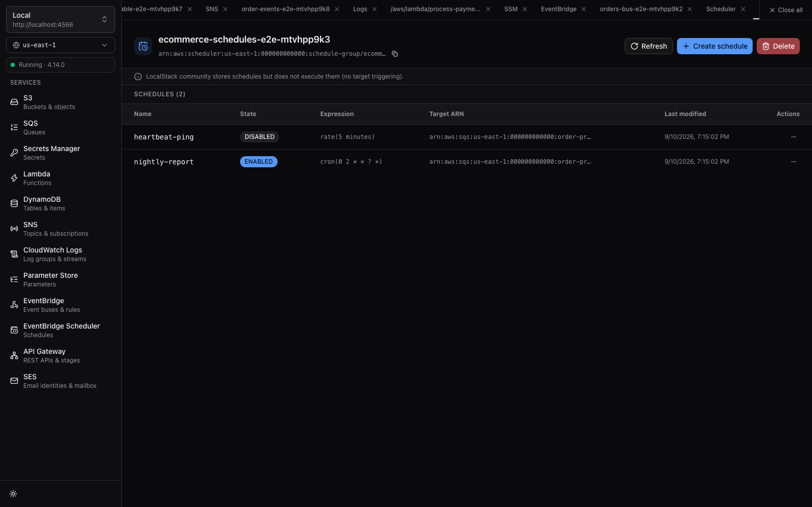

### API Gateway REST API & Method Inspector
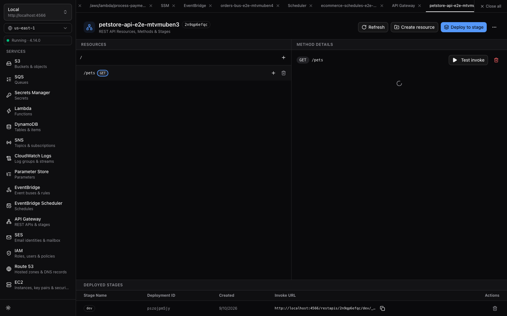

### SES Captured Mailbox & HTML Email Preview
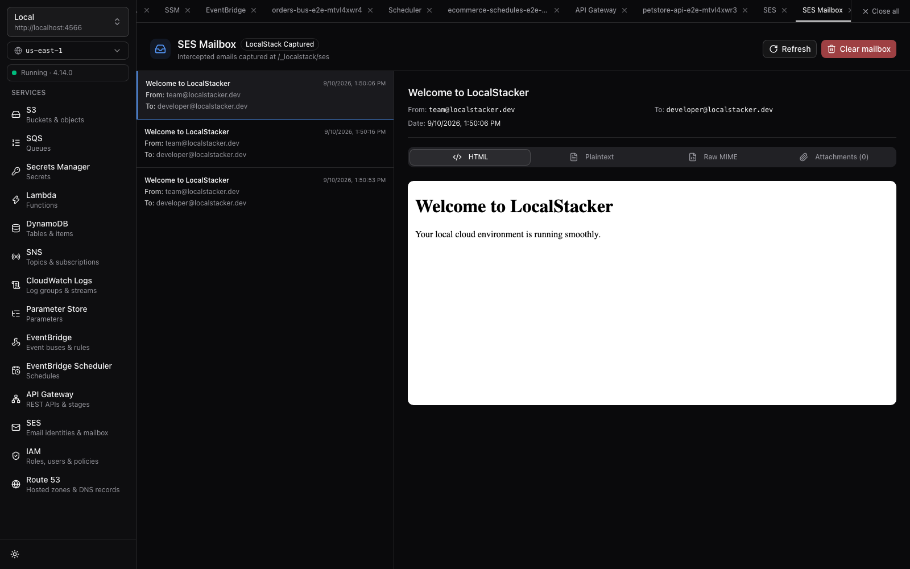

### IAM Role & Inline Policy Inspector
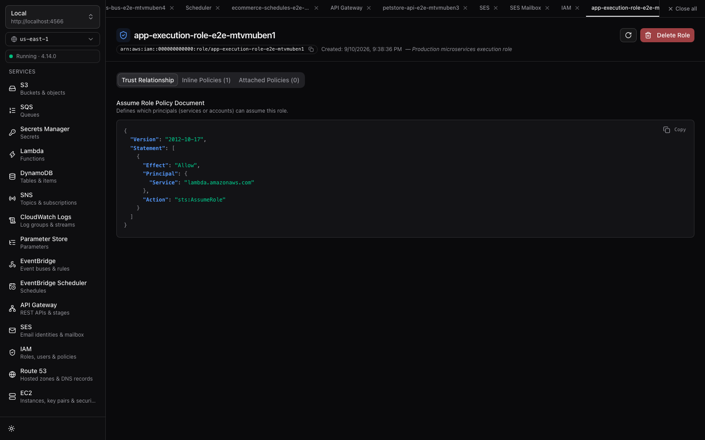

### Route 53 Hosted Zone & DNS Records Grid
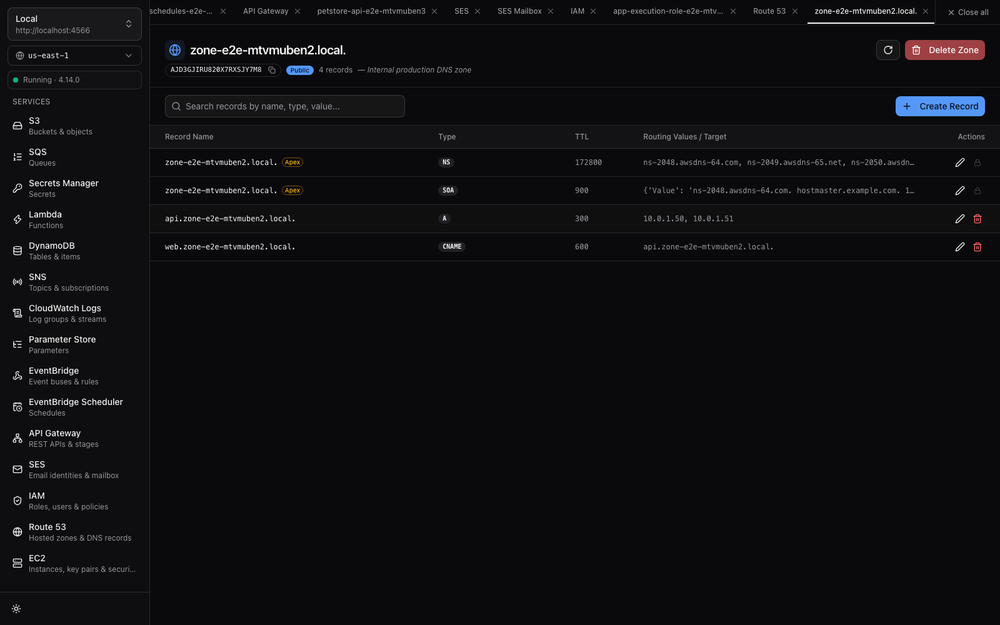

### EC2 Security Group Rule Matrix
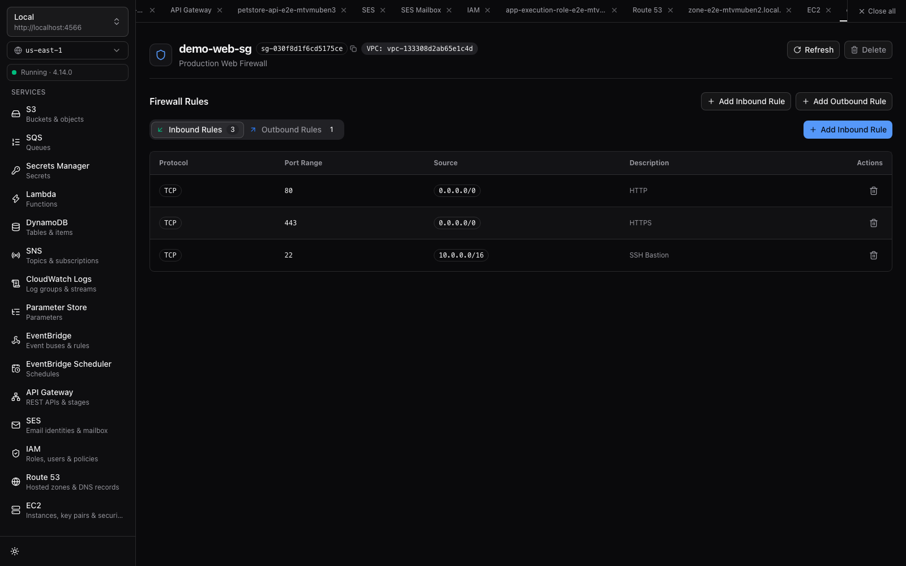

### EC2 Instances & Mock State Transitions
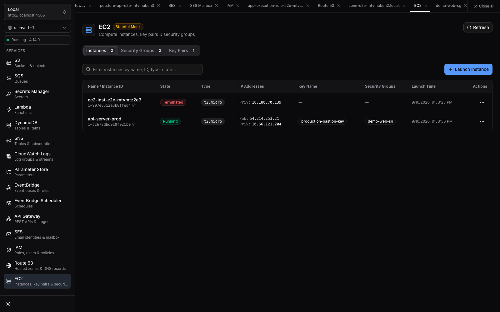

### Docker Lifecycle & Container Management
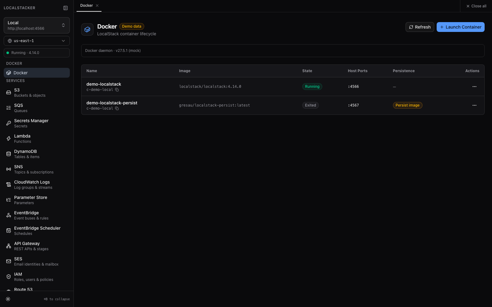

## Status & Roadmap

**v1.1.0 shipped** ✅ · **v1.2 in development** 🚧. Core milestones implemented and verified with end-to-end coverage:

| Milestone | Scope | Status |
|---|---|---|
| **M0** | Scaffold, app shell, connection profiles, health badge | ✅ Done |
| **M1** | S3 — buckets/objects, upload/download, presigned URLs | ✅ Done |
| **M2** | SQS — send, peek, purge, DLQ redrive | ✅ Done |
| **M3** | Lambda (invoke + logs) and Secrets Manager | ✅ Done |
| **M4** | Hardening — Playwright e2e suite, release engineering, auto-updater, v1.0.0 | ✅ Done |
| **M5** | **DynamoDB & SNS** — table inspector, scan/query, document editor; topic pub/sub & SQS subscription helper | ✅ Done |
| **M6** | **CloudWatch Logs & SSM Parameter Store** — log groups/streams viewer, live tailing, parameter hierarchy & SecureString decryption | ✅ Done |
| **M7** | **EventBridge & EventBridge Scheduler** — event buses/rules, PutEvents test publisher, schedules explorer | ✅ Done |
| **M8** | **API Gateway REST API & SES** — resource tree, method test runner, verified identities & captured mailbox viewer | ✅ Done |
| **M9** | **IAM & Route53** — role/policy inspector, access keys, hosted zones & DNS records grid | ✅ Done |
| **M10** | **EC2 Mock** — instance states, security groups rule matrix, key pairs | ✅ Done |
| **v1.1** | **Docker Lifecycle** — dedicated container panel: detect/inspect LocalStack containers (incl. `localstack-persist` images), snapshot+follow logs, start/stop/restart/remove with persistence-aware warnings, create wizard with service picker, image pull & auto-connect — via Docker socket (`bollard` in the Rust backend, no CLI sidecar) | ✅ Done |
| **v1.2** | **First-Run Onboarding** — live service lamp board on first launch, inline endpoint connect, one-click Docker create & auto-connect (`localstack/localstack:4.14.0`, persistence volume) | ✅ Done |
| **M11** | **Step Functions** — state machine list, ASL definition viewer, execution runner + event history, visual state graph (`react-flow`) | ✅ Done |
| **M12** | **DynamoDB Streams & Kinesis** — table stream enable + shard record peek; Kinesis streams, shard map, record peek, test publisher | ✅ Done |
| **M13** | **CloudWatch Metrics & STS** — metric browser + alarm CRUD feeding the Home status board; caller-identity card | ✅ Done |
| **M14** | **KMS & ACM** — key/alias management, encrypt-decrypt playground; certificate inventory with import/request | ✅ Done |
| **M15** | **CloudFormation & Route53 Resolver** — stack inspector (template, events, resources); resolver rules & endpoints | ✅ Done |

See [`docs/plan.md`](docs/plan.md) for detailed service contracts and architectural decisions.

## Development

Prerequisites: Node 22+, pnpm, Rust toolchain, Docker.

```sh
pnpm install
pnpm tauri dev
```

Point LocalStacker at a running LocalStack container:

```sh
docker run --rm -p 4566:4566 -v /var/run/docker.sock:/var/run/docker.sock localstack/localstack:4.14.0
```

> **Why LocalStack 4.14.0?**
> LocalStack 4.14.0 is pinned as the community release operating without mandatory auth tokens across core services. Mounting `/var/run/docker.sock` is required by LocalStack to execute Lambda function runtimes.

### Scripts

| Command | Purpose |
|---|---|
| `pnpm tauri dev` | Run desktop app with hot reload |
| `pnpm tauri build` | Build release installers locally |
| `pnpm dev` | Run frontend in browser dev mode |
| `pnpm typecheck` | Run TypeScript type checking (`tsc --noEmit`) |
| `pnpm test` | Run Vitest unit tests |
| `pnpm test:watch` | Run Vitest in watch mode |
| `pnpm e2e` | Run Playwright end-to-end test suite against LocalStack |
| `pnpm e2e:headed` | Run Playwright tests in headed browser mode |
| `pnpm screenshots` | Regenerate documentation screenshots |

### Releasing

1. Ensure working directory is clean on `main`.
2. Bump versions across `package.json`, `src-tauri/tauri.conf.json`, and `src-tauri/Cargo.toml`.
3. Verify test suites: `pnpm typecheck && pnpm test && pnpm e2e`.
4. Commit: `git commit -m "chore(release): vX.Y.Z"`.
5. Tag: `git tag -a vX.Y.Z -m "LocalStacker vX.Y.Z"`.
6. Push commit and tag: `git push origin main --tags`.
7. The GitHub Actions release workflow builds the cross-platform matrix, signs updater artifacts, and creates a draft release on GitHub. Review and publish the release.

#### Required Repository Secrets
- `TAURI_SIGNING_PRIVATE_KEY`: Private minisign key generated via `pnpm tauri signer generate`.
- `TAURI_SIGNING_PRIVATE_KEY_PASSWORD`: Passphrase protecting the private signing key.
- `APPLE_*` (optional): Set `APPLE_CERTIFICATE`, `APPLE_CERTIFICATE_PASSWORD`, `APPLE_ID`, `APPLE_PASSWORD`, `APPLE_TEAM_ID` when an Apple Developer account is configured for notarization. If omitted, the workflow cleanly skips notarization and produces unsigned DMGs.

## Stack

Tauri 2 · React 19 · TypeScript · Tailwind CSS v4 · shadcn/ui · TanStack Query · TanStack Virtual · Zustand · AWS SDK v3 · Playwright · Vitest + Testing Library

## Documentation

- [`docs/plan.md`](docs/plan.md) — product plan, v1 feature contract, milestones, risks
- [`docs/decisions.md`](docs/decisions.md) — ADR-style log of foundational architectural decisions

## Support

LocalStacker is free for personal, educational, and other noncommercial use. If it saves you time, consider:

[](https://buymeacoffee.com/ryleth)

## License

Licensed under the [PolyForm Noncommercial License 1.0.0](./LICENSE) — free to use, modify, and redistribute for **noncommercial purposes only** (personal projects, study, research, nonprofits, education, government). Commercial use, including use within a for-profit company's workflow or offering a paid product based on LocalStacker, requires a separate commercial license — reach out via [Buy Me a Coffee](https://buymeacoffee.com/ryleth) or [open an issue](https://github.com/thuanlegit/localstacker/issues).

This is not an OSI-approved open-source license; it is a source-available license. Third-party dependencies keep their own licenses (MIT, Apache-2.0, etc.) — see each dependency's repository.
